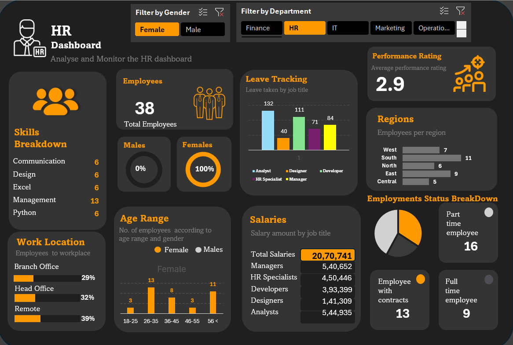

# HR Dashboard (Excel Project)

## 📊 Project Overview
This project is an interactive HR Dashboard built in Microsoft Excel to visualize and analyze key human resources metrics. It helps in monitoring workforce statistics such as employee count, department-wise distribution, attrition rate, and more.

## 🚀 Features
- Dynamic Pivot Tables and Charts
- Slicers for interactive filtering (e.g., department, gender, year)
- KPIs: Headcount, New Joinees, Attrition, etc.
- Conditional formatting for alerts and trends

## 🛠️ Tools Used
- Microsoft Excel
- Formulas (IF, COUNTIF, etc.)
- Pivot Tables and Charts
- Slicers and Filters

## 📂 Files Included
- `Dashboard.xlsx`: The main HR dashboard file
- `README.md`: This documentation

## 📸 Screenshot

## 👩‍💻 Author
- **Rupal0912**

